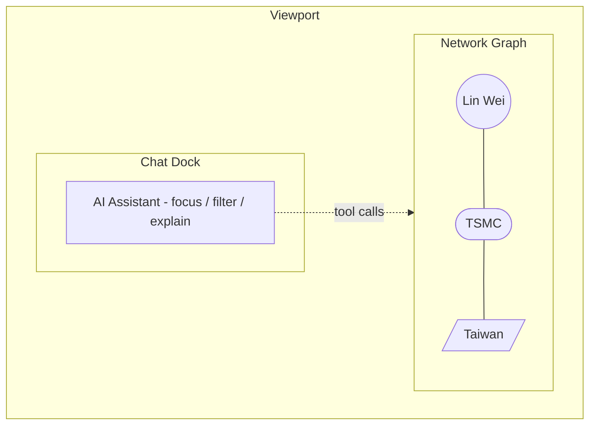
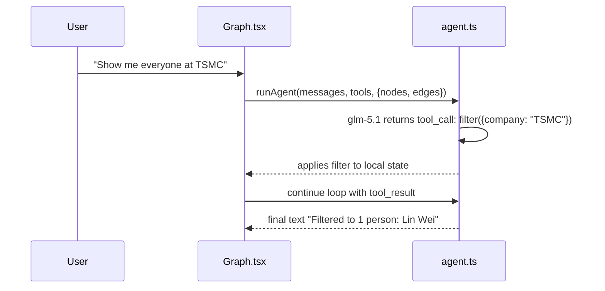

## Vision



- Node types: **Person** (circle, sized by `overall_score`, colored by existing `scoreColor`), **Company** (square), **Location** (state/country, pill)
- Edges: Person -> Company (works at), Person <-> Person (colleague at same company), Company -> Location (HQ)
- Chat dock at the bottom; LLM drives graph view via tool-calls
- Click a person node -> navigate to existing `/prospect/:id`. No separate inspector panel for v1.

## Library + provider choices

- **Graph**: `react-force-graph-2d` (canvas, true Obsidian-style physics). New dep.
- **AI**: Z.AI's GLM via the OpenAI-compatible endpoint (per [docs.z.ai](https://docs.z.ai/guides/overview/quick-start)). Use the `openai` npm SDK pointed at `baseURL: VITE_ZAI_BASE_URL` (`https://api.z.ai/api/paas/v4`) with model `glm-5.1`. Standard OpenAI function-calling for tools. `VITE_ZAI_API_KEY` required, hard-fail on init if missing. Browser-side call with `dangerouslyAllowBrowser: true` (acceptable for demo per `CLAUDE.md`; TODO comment in code to proxy via FastAPI later). Non-streaming for v1.
- **Env wiring**: `.env.local` already has `ZAI_API_KEY` and `ZAI_BASE_URL` (unprefixed — Vite won't expose them). Mirror as `VITE_ZAI_API_KEY` and `VITE_ZAI_BASE_URL` in `.env.local` and add to `.env.example`.
- Existing React Flow stays on `/prospect/:id` (org chart) — untouched.

## Data model (no schema changes)

Build the graph **derived from existing tables** at render time. No new Supabase tables.

[src/lib/graph.ts](src/lib/graph.ts) sketch:

```ts
const COMPANY_META: Record<string, { country: string; state?: string }> = {
  TSMC: { country: "Taiwan" },
  ASML: { country: "Netherlands" },
  Intel: { country: "USA", state: "California" },
  NVIDIA: { country: "USA", state: "California" },
  Infineon: { country: "Germany" },
};

export type GraphNode =
  | { id: string; kind: "person"; name: string; role: string; companyId: string; score?: number; raw: Prospect }
  | { id: string; kind: "company"; name: string; locationId?: string }
  | { id: string; kind: "location"; name: string; level: "state" | "country" };

export type GraphEdge = { id: string; source: string; target: string; kind: "works_at" | "colleague" | "located_in" };

export function buildGraph(args: {
  prospects: Prospect[];
  scores: Record<string, Score>;
}): { nodes: GraphNode[]; edges: GraphEdge[] };
```

- Person nodes from `useProspects()`, score from `useScoresFor`
- Company nodes from unique `prospect.company` (use the existing `normalizeCompany` from `ProspectDetail.tsx`)
- Location nodes from `COMPANY_META` lookup; missing -> single "Unknown" location node
- Colleague edges: any two persons sharing the same `companyId`

## File layout

**New (3 files):**

- [src/lib/graph.ts](src/lib/graph.ts) — `buildGraph()`, types, inline `COMPANY_META`
- [src/lib/agent.ts](src/lib/agent.ts) — OpenAI SDK pointed at Z.AI's base URL + tool schemas + tool loop. Model: `glm-5.1`. 3 tools:
  - `focus_node(query)` — fuzzy-match a node name; returns `{ id }` and lets caller set `selectedId`
  - `filter(criteria)` — `{ company?, country?, minScore? }`; returns set of node ids the UI should render; caller sets `filters`
  - `explain(id)` — returns the data bundle for the node (prospect + score + signals); LLM writes the prose in its final reply
- [src/pages/Graph.tsx](src/pages/Graph.tsx) — full page. Owns all state via `useState`:
  - `selectedId: string | null`
  - `filters: { company?: string; country?: string; minScore?: number }`
  - `messages: ChatMessage[]`
  Composes `<ForceGraph2D />` (full-bleed) + an inline `<ChatDock />` JSX (input + message list, ~280px tall). Tool-call traces render as plain `> filter({ company: "TSMC" })` lines above the assistant text.

**Modified (5 files):**

- [package.json](package.json) — add `react-force-graph-2d`, `openai`
- [.env.example](.env.example) — add `VITE_ZAI_API_KEY=` and `VITE_ZAI_BASE_URL=https://api.z.ai/api/paas/v4`
- [.env.local](.env.local) — mirror existing `ZAI_API_KEY` / `ZAI_BASE_URL` values as `VITE_ZAI_API_KEY` / `VITE_ZAI_BASE_URL` (Vite only exposes `VITE_*`)
- [src/App.tsx](src/App.tsx) — add `<Route path="/graph" element={<Graph />} />`
- [src/components/TopBar.tsx](src/components/TopBar.tsx) — add a "Graph" link

**Untouched:** `/`, `/validate`, `/discover`, `/settings`, `/prospect/:id`, scoring logic, `db.ts`, mock store, Supabase schema.

## Chat tool loop



The tool executors are pure functions over the locally-built `{ nodes, edges }` array; they return a result object that `Graph.tsx` uses to update its `useState`. No external store.

## Layout (matches the sketch)

```tsx
<div className="h-screen flex flex-col">
  <TopBar />
  <div className="flex-1 relative">
    <ForceGraph2D ... />          {/* fills available space */}
  </div>
  <div className="h-72 border-t"> {/* chat dock */}
    {messages.map(...)}
    <input ... />
  </div>
</div>
```

## What's deferred (clean follow-ups, not rewrites)

- NodeInspector slide-in panel (currently: click person -> `/prospect/:id`)
- Streaming chat + dedicated `ToolCallChip` UI (currently: non-streaming + plain-text traces)
- Tools: `expand_node`, `find_path`, `cluster_by`, `add_prospect`
- External graph state store (`useGraphState`) — extract once state grows past two fields
- Graph legend, keyboard shortcuts, richer location data (per-employee city)
- Supabase-persisted curated edges (introductions / "I know X")

## Open assumptions

- Browser-side Z.AI key is acceptable for demo posture per `CLAUDE.md`; marked with a TODO to move behind FastAPI proxy.
- Z.AI's `glm-5.1` supports OpenAI-style `tools` / `tool_choice` (per their OpenAI-compatibility docs); if it doesn't on the chosen endpoint, fall back to a tagged-text "intent" parser in agent.ts (regex on `[focus_node:Lin Wei]` style). Verify on first run.
- v1 uses only seeded prospects (currently 5 in mock mode); the graph is interesting enough at that size for the demo. Real Supabase mode will pull more from the existing `useProspects` automatically.
