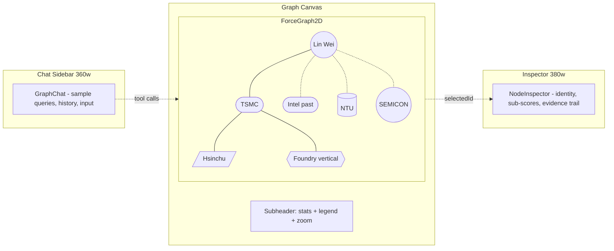

## Vision



- **Three rails**: chat sidebar (left, ~360w) | graph canvas with subheader (center, fluid) | node-aware inspector (right, ~380w)
- **Node types** (9): `person`, `company`, `role`, `city`, `school`, `conference`, `industry`, `past_employer`, `partnership`
- **Edge kinds** (10): `works_at`, `colleague`, `reports_to`, `located_in`, `past_employer`, `partnership`, `education`, `scope_signal`, `vertical`, `evidence_cited`
- **Top-bar filter pills**: when route is `/discover`, render color-dotted toggles for each edge kind (Reports, Employer, Location, Evidence, Scope, Partnership, Past empl., Education, Vertical)
- **Visual affordances**: halo on selected node, neighborhood fade (non-neighbors at low alpha), person size driven by `overall_score`, person color driven by score band (strong / plausible / weak)
- **Click person -> `/prospect/:id`** still works (preserves existing deep-dive)

## Library + provider choices

- **Graph**: `react-force-graph-2d` (canvas, true Obsidian-style physics; `nodeCanvasObject` for per-kind rendering). New dep.
- **AI**: Z.AI's GLM via OpenAI-compatible endpoint (per [docs.z.ai](https://docs.z.ai/guides/overview/quick-start)). `openai` npm SDK pointed at `baseURL: VITE_ZAI_BASE_URL` (`https://api.z.ai/api/paas/v4`), model `glm-5.1`. Standard OpenAI function-calling. `VITE_ZAI_API_KEY` required, hard-fail on init if missing. Browser-side `dangerouslyAllowBrowser: true` (TODO comment to proxy via FastAPI later). Non-streaming for v1.
- **Env wiring**: `.env.local` already has `ZAI_API_KEY` and `ZAI_BASE_URL` (unprefixed — Vite won't expose them). Mirror as `VITE_ZAI_API_KEY` and `VITE_ZAI_BASE_URL`.
- React Flow stays untouched on `/prospect/:id`.

## Data model

**Schema unchanged** — derived graph at render time. Mock-store enriched with three new per-prospect fields and one per-company-derived field.

[src/lib/mockStore.ts](src/lib/mockStore.ts) Prospect type extension (mock-only; Supabase rows ignore unknown fields):

```ts
type Prospect = {
  // ...existing
  past_companies?: string[];                          // ["Intel", "GlobalFoundries"]
  education?: { school: string; degree: string; year: number }[];
  talks?:    { venue: string; year: number }[];       // conferences
};

const COMPANY_META: Record<string, {
  city: string; country: string;
  industry: string;                                   // "Foundry", "EUV Lithography", "GPU Compute"
  partnerships: string[];                             // ["ASML", "Apple"]
}> = { TSMC: { city: "Hsinchu", country: "Taiwan", industry: "Foundry", partnerships: ["ASML", "Apple", "NVIDIA"] }, /* ... */ };
```

[src/lib/graph.ts](src/lib/graph.ts) types:

```ts
export type NodeKind = "person" | "company" | "role" | "city" | "school" | "conference" | "industry" | "past_employer" | "partnership";
export type EdgeKind = "works_at" | "colleague" | "reports_to" | "located_in" | "past_employer" | "partnership" | "education" | "scope_signal" | "vertical" | "evidence_cited";

export type GraphNode =
  | { id: string; kind: "person";        name: string; role: string; companyId: string; score?: number; confidence?: number; raw: Prospect }
  | { id: string; kind: "company";       name: string; cityId?: string; industryId?: string; partnerships: string[] }
  | { id: string; kind: "role";          title: string; holders: number; avgTenure: number }
  | { id: string; kind: "city";          name: string; country: string; candidates: number }
  | { id: string; kind: "school";        name: string }
  | { id: string; kind: "conference";    name: string }
  | { id: string; kind: "industry";      name: string }
  | { id: string; kind: "past_employer"; name: string }
  | { id: string; kind: "partnership";   name: string };

export type GraphEdge = { id: string; source: string; target: string; kind: EdgeKind; weight?: number };

export function buildGraph(args: {
  prospects: Prospect[];
  scores: Record<string, Score>;
  signals?: Record<string, Signal[]>;
}): { nodes: GraphNode[]; edges: GraphEdge[] };
```

Edge derivation rules:

- `works_at`: person -> their `company`
- `colleague`: any two persons sharing the same `companyId` (capped per-company to avoid quadratic blowup at scale)
- `located_in`: company -> city
- `vertical`: company -> industry
- `partnership`: company -> partnership node (deduped string)
- `past_employer`: person -> past_employer node (one node per unique string)
- `education`: person -> school
- `scope_signal`: person -> role node (when title fuzzy-matches a canonical role)
- `evidence_cited`: person -> signal-source node (one node per `signal.source` per person, weight = `signal.confidence`)
- `reports_to`: person -> person (inferred via existing `seniorityRank` from `ProspectDetail.tsx`; only when same company)

## Design tokens (src/index.css)

Add CSS variables under `:root` (and dark twin where the existing theme has one). Names mirror the Figma `Credence Tokens` collection. Placeholder hex values to be replaced once Figma values are in hand.

```css
:root {
  /* node colors — semantic, paired w/ kind */
  --node-person:        220 90% 56%;   /* TODO: Figma */
  --node-company:       260 70% 55%;
  --node-role:          145 55% 45%;
  --node-city:          30  85% 55%;
  --node-school:        200 60% 45%;
  --node-conference:    340 70% 55%;
  --node-industry:      50  85% 50%;
  --node-past-employer: 270 30% 55%;
  --node-partnership:   180 55% 45%;

  /* edge colors — match filter pills */
  --edge-reports:       0   0%  35%;
  --edge-employer:      220 90% 56%;
  --edge-location:      30  85% 55%;
  --edge-evidence:      280 70% 55%;
  --edge-scope:         145 55% 45%;
  --edge-partnership:   180 55% 45%;
  --edge-past-employer: 270 30% 55%;
  --edge-education:     200 60% 45%;
  --edge-vertical:      50  85% 50%;

  /* score bands — for halo + person fill */
  --score-strong:    142 70% 45%;
  --score-plausible: 45  90% 50%;
  --score-weak:      0   70% 55%;
}
```

## File layout

**New (4 files):**

- [src/lib/graph.ts](src/lib/graph.ts) — full type union, `COMPANY_META`, `buildGraph()`, edge-derivation helpers
- [src/lib/agent.ts](src/lib/agent.ts) — OpenAI SDK at Z.AI base URL, 4 tool schemas, tool loop
- [src/components/NodeInspector.tsx](src/components/NodeInspector.tsx) — right rail, per-node-kind variants
- [src/components/GraphChat.tsx](src/components/GraphChat.tsx) — left rail, hint chips + history + input

**Modified (7 files):**

- [package.json](package.json) — add `react-force-graph-2d`, `openai`
- [.env.local](.env.local) — add `VITE_ZAI_API_KEY` + `VITE_ZAI_BASE_URL` mirrors
- [.env.example](.env.example) — same
- [src/index.css](src/index.css) — node + edge + score CSS variables
- [src/lib/mockStore.ts](src/lib/mockStore.ts) — seed `past_companies`, `education`, `talks` on each prospect; bump seed to 8–10 prospects across TSMC/ASML/Intel/NVIDIA/Infineon/AMD/Samsung; add `COMPANY_META` partnerships
- [src/components/TopBar.tsx](src/components/TopBar.tsx) — when `useLocation().pathname === "/discover"`, render edge-kind filter pills with color dots; pills toggle a `Set<EdgeKind>` lifted via context or a small Zustand slice (deferred — for v1, use a top-level state in `Discover.tsx` and read it via a `EdgeFilterContext` provider mounted in `Discover.tsx` so the TopBar pills are bound to the same state)
- [src/pages/Discover.tsx](src/pages/Discover.tsx) — **full replace** of the current table view. Owns: `selectedId`, `edgeKindsVisible: Set<EdgeKind>`, `filters`, `messages`, `hoverNeighborIds`. Composes the three rails.

**Untouched:** `/`, `/validate`, `/settings`, `/prospect/:id`, scoring logic, `db.ts`, Supabase schema.

## Tool catalog (agent.ts)

OpenAI function-calling style; 4 tools.

- `focus_node({ query: string })` — fuzzy-match across all node names; returns `{ id, kind }`. Caller sets `selectedId`.
- `filter({ company?, role?, city?, industry?, edgeKinds?: EdgeKind[], minScore? })` — returns `{ visibleNodeIds, visibleEdgeIds }`. Caller sets `filters` + `edgeKindsVisible`.
- `explain({ id })` — returns the data bundle for the node (shape varies per kind; mirrors NodeInspector variants). Model writes prose using the bundle in its final reply.
- `expand_node({ id, hops?: 1 | 2 })` — BFS from the node up to N hops; returns `{ visibleNodeIds, visibleEdgeIds }` to merge into current visible-set.

System prompt (in `agent.ts`):

> You're an analyst exploring a graph of people, companies, and contextual nodes
> (cities, schools, conferences, industries, past employers, partnerships).
> Use the four tools to help the user navigate. Prefer `filter` over enumerating
> nodes in prose. Always call `explain` before describing a node in detail.
> Available node kinds: ... Available edge kinds: ...

## Chat tool loop

```mermaid
sequenceDiagram
    participant User
    participant Page as Discover.tsx
    participant Agent as agent.ts
    User->>Page: "Show me everyone at TSMC who reports to a VP"
    Page->>Agent: runAgent(messages, tools, snapshot)
    Agent->>Agent: glm-5.1 returns tool_call: filter({company: "TSMC", edgeKinds: ["reports_to"]})
    Agent-->>Page: applies visible-set + edgeKinds
    Page->>Agent: continue loop with tool_result
    Agent->>Agent: tool_call: explain({id: "p_lin_wei"})
    Agent-->>Page: returns bundle; final reply
    Agent-->>Page: "Filtered to 1 person at TSMC. Lin Wei reports to ..."
```

Tool executors are pure functions over the locally-built `{ nodes, edges }` snapshot; they return result objects that `Discover.tsx` uses to update its `useState`. No external store.

## Layout (3 rails)

```tsx
// src/pages/Discover.tsx
<div className="h-screen flex flex-col">
  <TopBar />                                   {/* edge-kind filter pills appear here */}
  <div className="flex-1 grid grid-cols-[360px_1fr_380px] min-h-0">
    <GraphChat                                  /* left */
      messages={messages}
      onSend={handleSend}
    />
    <div className="relative flex flex-col min-h-0 border-x border-border">
      <Subheader stats={...} />                {/* nodes/edges/candidates/selected + legend */}
      <ForceGraph2D                             /* center */
        nodeCanvasObject={paintByKind}
        linkColor={l => edgeColor(l.kind)}
        onNodeClick={n => setSelectedId(n.id)}
        // halo + neighborhood fade computed from selectedId + hoverNeighborIds
      />
    </div>
    <NodeInspector                              /* right */
      node={selectedNode}
      onOpenProfile={id => navigate(`/prospect/${id}`)}
    />
  </div>
</div>
```

## What's deferred

- Streaming chat + dedicated `ToolCallChip` component (currently: non-streaming + plain-text traces above the assistant turn)
- Tool: `find_path`
- External graph state store (extract once `Discover.tsx` state grows past ~6 fields)
- Keyboard shortcuts (`/` focuses chat; `Esc` clears selection)
- Supabase-persisted curated edges (intros, "I know X")
- Real Figma color values (current tokens are HSL placeholders; replace once tokens are confirmed)

## Open assumptions

- Browser-side Z.AI key acceptable for demo (per `CLAUDE.md`); TODO to proxy via FastAPI.
- Z.AI's `glm-5.1` honors OpenAI `tools` / `tool_choice`; if not, fall back to a tagged-text intent parser in `agent.ts`. Verify on first run.
- Inspector rail size (~380w) and chat rail size (~360w) match Figma. Tweak after eyeballing alongside the design.
- Edge-derivation rules (esp. `reports_to` from `seniorityRank`) are heuristic; good enough for the demo, replace with explicit edge data later.
